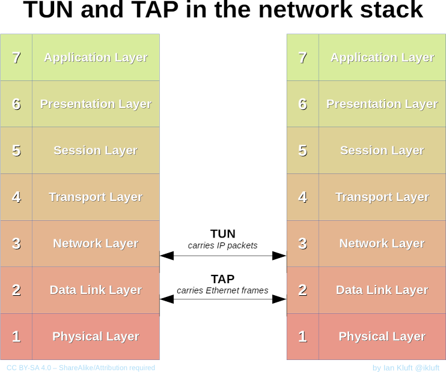
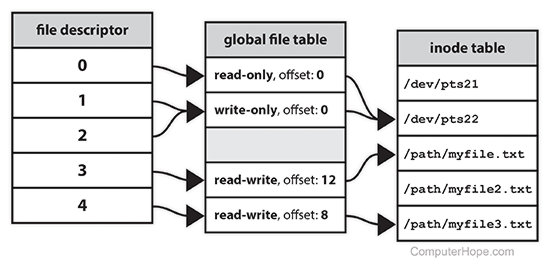
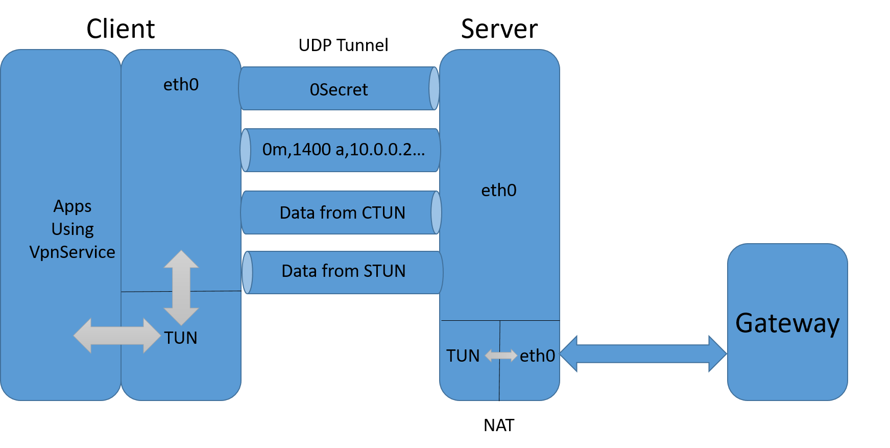

# **VpnService简介**
**以ToyVpn为例**


---

<!-- paginate: true -->

# 什么是VpnService

- 安卓提供给开发者的用户级的VPN服务的接口
- 创建一个虚拟网卡（[TUN](https://zh.wikipedia.org/wiki/TUN与TAP)）
- 返回给APP一个"文件描述符"（File descriptor）
- 工作在网络层（收发IP数据包）

---



***TUN/TAP*** provides packet reception and transmission for user space programs. It can be seen as a simple Point-to-Point or Ethernet device, which,instead of receiving packets from physical media, receives them from user space program and instead of sending packets via physical media writes them to the user space program. 

---

### 文件描述符（File descriptor）



- 非负整数
- 指向文件或io资源
- int

```c
int interface = open("/dev/net/tun", O_RDWR | O_NONBLOCK);
write(interface, packet, length);
```

---

### IP数据包
[!](https://www.freesoft.org/CIE/Course/Section3/7.htm)


---

### 使用VpnService的***套路***

1. VpnService.prepare()
2. Builder builder = new Builder()
3. mInterface = builder.setSession().addAddress().addDnsServer()
   .addRoute().establish()
4. FileInputStream in = new FileInputStream(
                mInterface.getFileDescriptor())
5. FileOutputStream out = new FileOutputStream(
                mInterface.getFileDescriptor());
6. in.read()
7. out.write()

---

# 什么是ToyVpn

- 安卓官方的例程
- 演示如何用VpnService class构建VPN client
- 实现**IP over UDP**的隧道 
- 包含用Java实现的客户端和C实现的服务器
- 使用VPN服务的app流量通过隧道由服务器代理

---

### ToyVpn的通信过程



---

# 其他问题

- NAT
- 处理超时

---


### NAT(Network Address Translation)

在IP数据包通过路由器或防火墙时重写来源IP地址或目的IP地址的技术

```bash
iptables -t nat -A POSTROUTING -s 10.0.0.0/8 -o eth0 -j MASQUERADE
```

***不是所有的网卡名都是eth0***

---


### 客户端的超时问题

- lastSendTime
- lastReceiveTime
- （UDP Tunnel）太久不发，则发0
- （UDP Tunnel）太久收不到数据，认为连接中断

---


### 服务器的超时问题

- timer表征收发状态，同时表征收发间隔
- timer += (timer > 0) ? 100 : -100;
- （UDP Tunnel）太久（timer < -16000）不发，则发0
- （UDP Tunnel）太久(timer > 20000)收不到数据，认为连接中断

---

### 演示ToyVpn


---

# <!--fit--> 谢谢🙏！！


